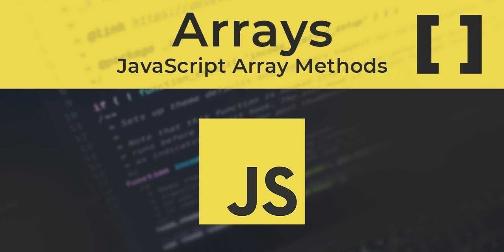

# JavaScript Arrays & Array Methods Lab

## Introduction
This lab provides an opportunity to practice defining, accessing and manipulating arrays.

Feel free to reference the arrays lesson, collaborate, google, etc.

## Setup & Instructions
- Fork this repo to your GitHub Enterprise account
- Clone it to your local machine
- `cd DLVR-JS-Arrays`
- Follow the instructions and type your answers where indicated in the [`app.js`](./app.js) file

## Solution
Check out the `solutions` branch of the repository if you get stuck! Try your best first before looking.

## Additional Resources
- [MDN Arrays](https://developer.mozilla.org/en-US/docs/Web/JavaScript/Reference/Global_Objects/Array)

## Licensing
1. All content is licensed under a CC­BY­NC­SA 4.0 license.
2. All software code is licensed under GNU GPLv3. For commercial use or alternative licensing, please contact legal@ga.co.
